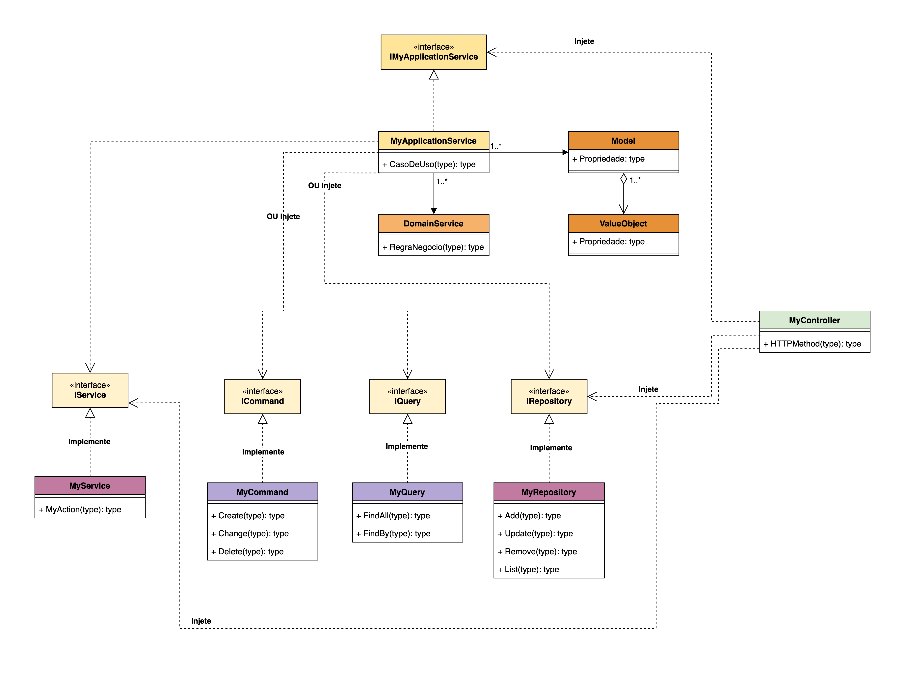

# [dotnet] Lab Arquitetura 2023 (work in progress)

<h1>Modelo explicado</h1>
<p>Esse modelo não pretende ser uma solução que implementa de forma exaustiva todos os conceitos de engenharia de software. A
pretensão é ser um ponto de partida para o início do projeto e permitir que a arquitetura seja extendida conforme ela é descoberta ao
longo do desenvolvimento.</p>
<p>O que se tem em mente é permitir que o código seja organizado de forma que se possa automatizar testes unitários com o objetivo de
preservar a consistência das regras de negócio a cada incremento.</p>
<p>Conforme o projeto evolui e a complexidade é descoberta, é possível extender o modelo e, quando necessário refatorar em direção à um
design diferente. Para outras opções pode consultar os publicados pelo Martin Fowler<sup>9</sup>.</p>

<h3>FAQ</h3>
<p><b>Neste projeto está usando Kakfa e gRPC, só funciona com essas tecnologias?</b> <br />R: Não! A utilização delas nesse projeto é com o intuito de criar cenários que criem necessidades de solução. Assim como qualquer conceito de engenharia de software, deve ser adotado aquilo que faz sentido e é necessário ao projeto</p>
<p><b>Ah! Mas no meu time fazemos diferente... Esse conceito está errado porque Fulano diz que...</b><br/>R: 👍</p>
<p><b>É DDD?</b><br />R: Não. São camadas.</p>
<p><b>Mas usa termos como Domain, Model, etc?</b><br />R: Sim. Hoje faz mais sentido o entendimento desses termos ao invés de utilizar BusinessLayer, DataLayer, e qualquer outra generalização. Está errado usar outros nomes? Não. Se fizer sentido à todos envovidos no projeto.</p>
<p><b>Outro erro, não está usando <i>...coloque aqui o nome do seu componente favorito...</i>?</b><br />R: 😞</p>

<br/>



<h2>Models & Value Objects</h2>
<p>Devem representar o domínio do negócio que a aplicação está resolvendo. As models são entidades do modelo que tem valor para o usuário. Os Value Objects são objetos que, embora tenham importância, não tem razão para existir por si no domínio do negócio, portanto existem como um agregado à uma entidade.</p>

```C#
// Exemplo de Entidade
public class Cliente {
    ...
}

// Exemplo de Value Object
public class Endereco {
    ...
}

// Value Object pode agregar uma entidade
public class Cliente {
    public Endereco EnderecoResidencial {get; set;}
    ...
}

// Afim de resolver propriedades e comportamentos comuns às models e value object pode-se criar uma interface
public abstract class BaseObject {
    public Guid Id {get; set;} = Guid.NewGuid();
    ...
}

// Interface realizada nas models e value objects
public class Cliente : BaseObject {
    ...
}
```

<h2>Domain Services</h2>
<p>Os Domain Services isolam regras de negócio que fazem sentido no contexto do negócio</p>

```C#
public class NotaFiscalDomainService {
    public decimal CalcularImpostos(NotaFiscal notaFiscal) {
        ...
    }

    ...
}
```

<h2>Application Services</h2>
<p>Responsável por orquestrar os Domain Services para atender casos de uso dentro do contexto do negócio.</p>

```C#
public class FechamentoFolhaApplicationService {
    public void Executar() {
        ...
        folhaDomainService.ApurarHorasExtras(...);
        folhaDomainService.ApurarDescontos(...);
        tributosDomainService.CalcularIRRF(...);
        ...
    }
    ...
}
```

<h2>Services</h2>
<p>Definem contratos para expor serviços que serão consumidos pelo domínio do negócio sem expor detalhes da implementação do serviço.</p>

```C#
// Definição do serviço
public interface IEmailService {
    void EnviarEmailBoasVindas(Funcionario funcionario);
}

// Consumo do serviço dentro do Application Service
public class AdmissaoApplicationService {
    private readonly IEmailService _emailService;

    public AdmissaoApplicationService(..., IEmailService emailService) {
        _emailService = emailService;
        ...
    }

    public void Admitir(Pessoa pessoa) {
        ...
        _emailService.EnviarEmailBoasVindas(funcionarioCriado);
        ...
    }
}
```

<h2>Repositories, Commands e Queries</h2>
<p>Representam contratos para trabalhar com repositórios dentro do Application Model sem expor detalhes da implementação.</p>

```C#
// Definição de um repositório
public interface IFuncionariosRepository {
    IEnumerable<Funcionario> ListarTodos();
    void Inserir(Funcionario funcionario);
    ...
}

// Consumo do repositório dentro do Application Service
public class AdmissaoApplicationService {
    private readonly IFuncionariosRepository _funcionariosRepository;

    public AdmissaoApplicationService(..., IFuncionariosRepository funcionariosRepository) {
        _funcionariosRepository = funcionariosRepository;
        ...
    }

    public void Admitir(Pessoa pessoa) {
        ...
        _funcionariosRepository.Inserir(funcionarioCriado);_
        ...
    }
}
```

<h1>Automação de Testes Unitários</h1>

<p>Nesse projeto foi adotado o NUnit como framework para automação de testes. A escolha foi arbitrária. Pode-se usar outros como o xUnit ou MSTest ou outras. Nesse projeto é priorizado o que o .Net Framework oferece.</p>
<p>A pretensão não é convencer adotar metodologia TDD, BDD, etc. Apenas expor uma forma de garantir a integridade da parte mais importante do projeto a cada incremento. Deve-se ter em mente que a automação aqui não é extensiva a ponto de cobrir 100% do projeto. Considere ler sobre pirâmide de testes<sup>10<sup>.</p>

<br/>
<h1>Comandos úteis</h1>

## Executar os projetos

```bash
# Keycloak - Na pasta bin do keycloac
sh ./kc.sh start-dev --features=declarative-user-profile

# Frontend Angular - Na pasta do angular
ng serve

# API e Service Worker
dotnet run
```

## Comandos do Kafka
```bash
# Iniciar serviço ZooKeeper
sh bin/zookeeper-server-start.sh config/zookeeper.properties

# Iniciar Kafka broker service
sh bin/kafka-server-start.sh config/server.properties

# Criar um tópico
sh bin/kafka-topics.sh --create --topic nome-topico --bootstrap-server localhost:9092

# Listar tópicos
sh bin/kafka-topics.sh --describe --topic quickstart-events --bootstrap-server localhost:9092

# Escrever uma mensagem no tópico
sh bin/kafka-console-producer.sh --topic quickstart-events --bootstrap-server localhost:9092

# Receber mensagem do tópico
# note que o parâmetro --from-beginning lê todas as mensagens desde o início
sh bin/kafka-console-consumer.sh --topic quickstart-events --from-beginning --bootstrap-server localhost:9092

# Para apagar os dados gerados durante os testes
rm -rf /tmp/kafka-logs /tmp/zookeeper /tmp/kraft-combined-logs
```

<h1>Referências</h1>

- [[1] dotnet core WebAPI](https://learn.microsoft.com/en-us/aspnet/core/web-api/?WT.mc_id=dotnet-35129-website&view=aspnetcore-7.0)
- [[2] Angular](https://angular.io/)
- [[3] Bootstrap](https://getbootstrap.com/docs/5.3/getting-started/introduction/)
- [[4] gRPC](https://grpc.io/)
- [[5] Documentação do Keycloak](https://www.keycloak.org/docs)
- [[6] Testes unitários NUnit](https://www.devmedia.com.br/teste-unitario-com-nunit/41236)
- [[7] Microsserviços](https://learn.microsoft.com/fr-fr/azure/architecture/guide/architecture-styles/microservices)
- [[8] JSON:API - A specification for building APIs in JSON](https://jsonapi.org/)
- [[9] Martin Fowler - Application Architecture](https://martinfowler.com/tags/application%20architecture.html)
- [[10] Practical Test Pyramid](https://martinfowler.com/articles/practical-test-pyramid.html)