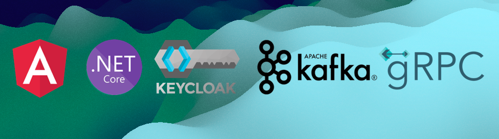
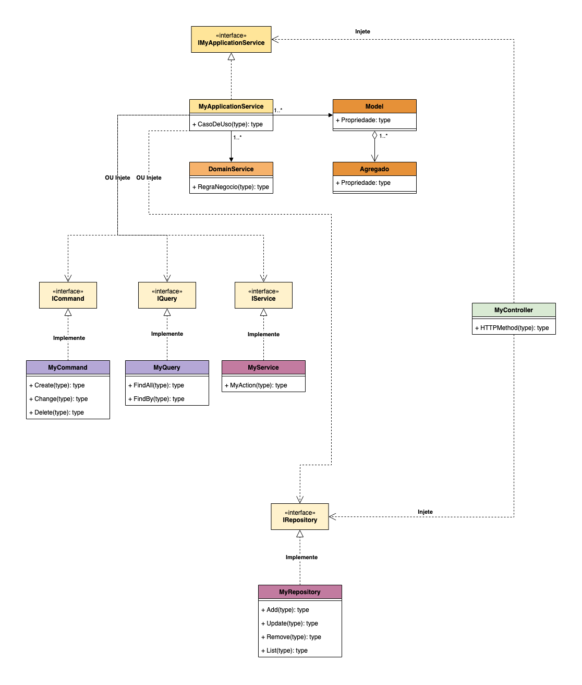

# [dotnet] Lab Arquitetura 2023
<br />

## Executar os projetos
```bash
# Keycloak - Na pasta bin do keycloac
sh ./kc.sh start-dev --features=declarative-user-profile

# Frontend Angular - Na pasta do angular
ng serve

# Frontend API - Na pasta da api do frontend
## Roda os testes, se não falhar, sobe a API
dotnet test && dotnet run
```

## Comandos do Kafka
``` bash
# Iniciar serviço ZooKeeper
sh bin/zookeeper-server-start.sh config/zookeeper.properties

# Iniciar Kafka broker service
sh bin/kafka-server-start.sh config/server.properties

# Criar um tópico
sh bin/kafka-topics.sh --create --topic nome-topico --bootstrap-server localhost:9092

# Listar tópicos
sh bin/kafka-topics.sh --describe --topic quickstart-events --bootstrap-server localhost:9092

# Escrever uma mensagem no tópico
sh bin/kafka-console-producer.sh --topic quickstart-events --bootstrap-server localhost:9092

# Receber mensagem do tópico
# note que o parâmetro --from-beginning lê todas as mensagens desde o início
sh bin/kafka-console-consumer.sh --topic quickstart-events --from-beginning --bootstrap-server localhost:9092

# Para apagar os dados gerados durante os testes
rm -rf /tmp/kafka-logs /tmp/zookeeper /tmp/kraft-combined-logs
```

## Modelo


## Referências
- [dotnet core WebAPI](https://learn.microsoft.com/en-us/aspnet/core/web-api/?WT.mc_id=dotnet-35129-website&view=aspnetcore-7.0)
- [Angular](https://angular.io/)
- [Bootstrap](https://getbootstrap.com/docs/5.3/getting-started/introduction/)
- [gRPC](https://grpc.io/)
- [Documentação do Keycloak](https://www.keycloak.org/docs)
- [Testes unitários NUnit](https://www.devmedia.com.br/teste-unitario-com-nunit/41236)
- [Microsserviços](https://learn.microsoft.com/fr-fr/azure/architecture/guide/architecture-styles/microservices)
- [JSON:API - A specification for building APIs in JSON](https://jsonapi.org/)